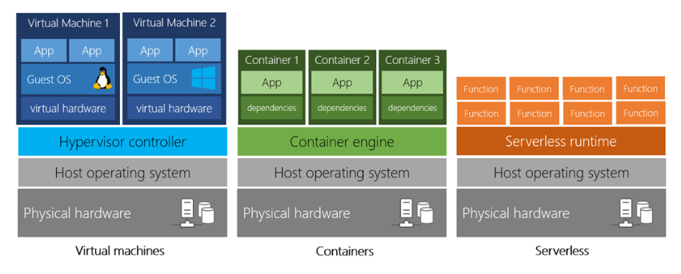

# Using Azure Services for Developing Solutions 
Repository for knowing various Azure services for developers.
Core concept of azure are compute,storage,databases,integration,networking.
this is a developer only guide so we are not touching other azure services but only requried by developers.

## What Azure Offers
* Services for Running applications also known as compute
  1. IaaS: VM, Container Services, Container Instances, Web App for Containers, Batch, Service Fabric
  2. PaaS: Cloud Services, Mobile app, Web App, Service fabric
  3. LaaS: Logic apps, Functions
  
* Services for Storing data
  1. Relational Data: Azure SQL db/MYSQL db/PostgreSQL db/Maria db
  2. Document or Unstructured Data: Cosmos DB / Azure Storage ( files, blobs, Queue, Table, Disk etc)
  3. Data Analytics : Data warehouse / Data Lake Store
* Services for Securing applications and data
  1. Authentication : AD (Azure Active Directory)
  2. Encryption ( protect data at rest) : Encryption features provided.
  3. Store User Identities : Azure Active Directory.
  4. Store Keys/Secrets : Key valut.
  5. Provide TLS certificate : App Service Certificate. 
* Services for Analysing data
  1. Azure Data Factory
  2. Azure Analysis Service
  3. Azure Data Lake Analytics
  4. Azure Stream Analysis
  5. Azure Time Series Insight
  6. Azure Data Bricks
  7. Azure HD Insights
* Services for Monitoring your applications
  1. Azure Application Insights
  2. Azure Log Analytics
  3. Azure Network Watcher
  4. Azure Monitor 
  5. Azure Security Center
  6. Azure Advisor
  7. visual studio app center
* Services for Adding Intelligence to your applications
  1. Machine Learning
  2. Congitive Services
  3. BOT Framework
* Services for Event/Messaging between applications
  1. command : azure storage queues, <a href="https://docs.microsoft.com/en-us/azure/service-bus-messaging/"> azure service bus </a>,   <a href="https://docs.microsoft.com/en-us/azure/service-bus-messaging/service-bus-dotnet-how-to-use-topics-subscriptions">azure servie bus topics</a> , <a href="https://docs.microsoft.com/en-us/azure/iot-hub/"> azure IOT hubs</a>, <a href="https://docs.microsoft.com/en-us/azure/logic-apps/"> Azure Logic Apps </a>
  2. facts : discreet - azure event Grids , streaming - azure event hubs
  3. mass notification : azure notification hubs
* Services for Speeding and improving performance of the applications
  1. Redis Cache
  2. Traffic Manager
  3. CDN 
* Services for Building/Testing/Deploying
  1. VS Team Foundation Services
  2. VS App Center
  3 Azure devops Projects
