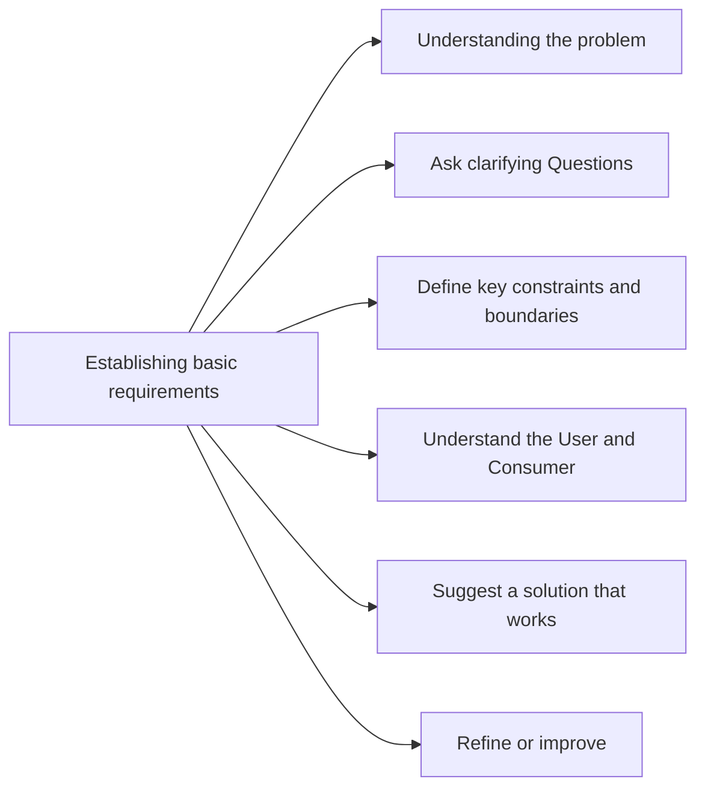
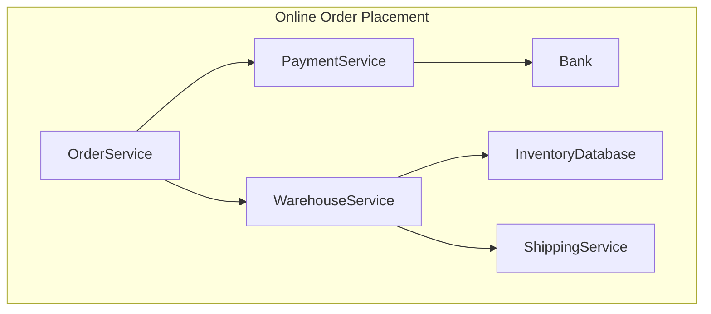

At every moment of interview you will have mto make a choice, in-orde to make a choice , we suggest to adopt a few techniques which will help you to organize your itenrviews into logical sections as well. 

define how basic requirements for an system design interview  should be established between and interviewer and interviewee. 

### Decision matrix

A decision matrix is a visual comparison of how various alternatives stack up against one another. Use a decision matrix to qualify design alternatives so a decision can be made. A decision matrix can also be used in documentation as a part of the design’s rationale.

- Use to compare a variety of decisions such as patterns, technologies, or frameworks.
- Visualize relative strengths and weaknesses among decisions.
- Focus attention on essential factors when comparing and contrasting alternatives.
- Facilitate open discussion about trade-offs among alternatives.

### Sequence Diagrams 

example a simple sequence diagram for showing flow of Online - Order Placement Service

_**BENEFITS**_ \
Simple and flexible notation \
Useful for communication and reasoning \
Helps to identify missing informations

### Scenario Walkthrough

Describe step-by-step how the architecture addresses a specific quality attribute scenario. Scenario walkthroughs can be used any time but are most applicable early in the life of the software system, before the system’s behavior can be observed directly.

A scenario walkthrough is like telling a story about the architecture. Pick a quality attribute scenario and describe what the system would do in response to the scenario stimulus. As you walk through the various elements in your design, show how the quality attribute is promoted (or not) by the system.

_**BENEFITS**_ \
Assess the architecture design early, even while it’s only on paper. \
Identify different concerns in the architecture. \
Reason about how the architecture will respond to different stimuli. \
Qualify the design. Walkthroughs are not strict pass or fail. \
Quickly determine the extent to which the architecture promotes or inhibits different quality attributes. 

### Distribution Strategy
This by is most impacting strategy which leads to people implementing various load balancing algos after wrongly distributing their object. 

“Distribute an application by putting different components on different nodes.”
This is by far the most troubling statement.

When asked why?

“"We can run each component on a separate box. If one component gets too busy we add extra boxes for it so we can load-balance our application”

#### Remote and Local Interfaces

We must understand that distribution by class need not to work every time. It has to do with coarse- and fine-grained interfaces.
When same OO principles are applied on a remote object model as for local, that might result in overhead as remote calls are costly compared to local calls which are very fast. 

If you base your distribution strategy on a class, you'll end up with a system that does a lot of remote calls needs awkward coarse-grained interfaces. In the end, even with coarse-grained interfaces on every remo-table class, you'll still end up with too many remote calls and a system that's awkward to modify as a bonus

How, then, do you effectively use multiple processors? In most cases the way to go is clustering
Put all the classes into a single process and then run multiple copies of that process on the various nodes. at way each process uses local calls to get the job done and thus does things faster. You can also use fine grained interfaces for all the classes within the process and thus get better maintainability with a simpler programming model