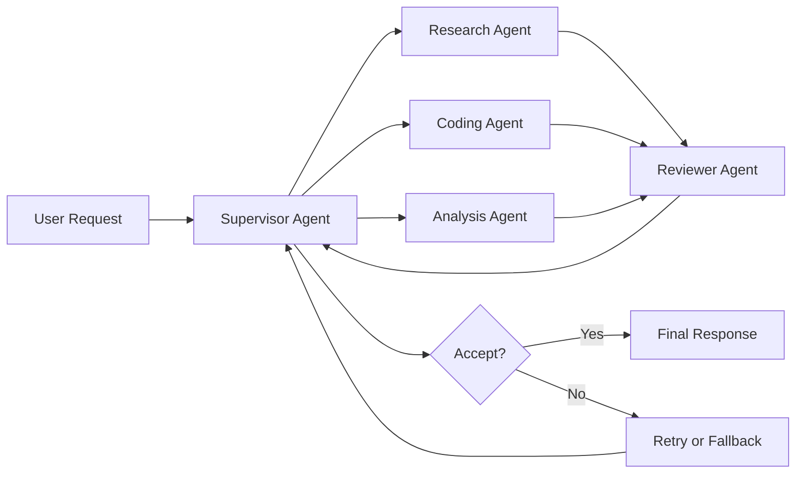
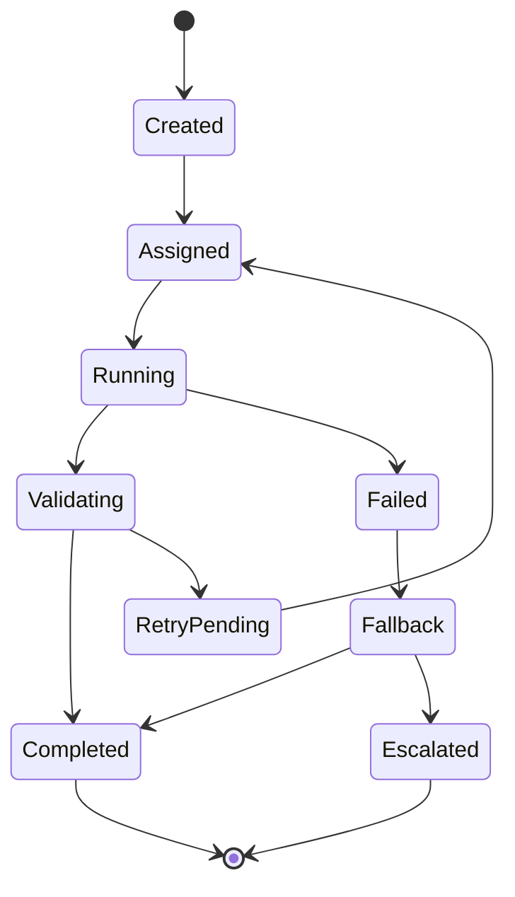

# Agent-to-Agent Protocols in Practice

Multi-agent systems are quickly moving from demos to production. The main challenge is no longer "can one agent call another?" The real challenge is making handoffs deterministic, observable, and safe under failure.

Most outages in agent systems come from protocol gaps:

- Ambiguous task ownership
- Missing output schema validation
- Retry storms without idempotency
- Policy context dropped between hops

If you solve these protocol issues first, you can scale capabilities later without rewriting orchestration from scratch.

## Key Takeaways

- Multi-agent reliability depends more on protocol quality than prompt quality.
- Every handoff should carry task context, policy constraints, budget, and a return schema.
- Retries, validation, and fallback paths should be built into the orchestration design from day one.
- Observability across handoffs is what makes production debugging and improvement possible.

## Why This Matters

In single-agent systems, prompt quality dominates outcomes. In multi-agent systems, interface quality dominates outcomes. A great specialist agent still fails if the envelope sent to it is incomplete or contradictory.

Think about A2A the same way you think about service-to-service APIs:

- Clear contracts
- Versioned payloads
- Deterministic error semantics
- Traceability across hops

The model can be probabilistic. Your protocol should not be.

## The Handoff Contract Every Team Needs

Each handoff payload should be explicit about task, guardrails, and expected output:

```json
{
	"protocolVersion": "1.2",
	"handoffId": "h_8f0c2a",
	"traceId": "tr_52bb11",
	"task": {
		"objective": "Summarize incident impact by region",
		"successCriteria": [
			"Cite source artifacts",
			"Output valid region-level table"
		],
		"deadlineMs": 25000
	},
	"policy": {
		"classification": "internal",
		"allowedTools": ["log_query", "metrics_query"],
		"disallowedActions": ["write_ticket", "send_email"]
	},
	"budget": {
		"maxToolCalls": 5,
		"maxTokens": 12000
	},
	"returnSchema": {
		"type": "object",
		"required": ["result", "confidence", "citations", "nextStep"]
	}
}
```

This contract prevents hidden assumptions and makes it possible to enforce policy before execution.

## A Reliable Multi-Agent Topology

For most teams, supervisor plus specialist agents is the best first production architecture.

<Diagram name="a2a-orchestration" />



### Why this topology works

- The supervisor owns state transitions.
- Specialists stay narrow and testable.
- Reviewer enforces quality and schema compliance.
- Retry and fallback decisions remain centralized.

## Failure Modes and Defensive Patterns

### 1. Timeout and Partial Completion

Agent finishes 60 percent of work and times out before response serialization.

Use:

- Checkpoint state after each sub-step
- Idempotency key per handoff
- Resume token for continuation

### 2. Schema Drift Across Agents

An upstream agent adds a field that downstream parser ignores, or removes a required field.

Use:

- Versioned schemas (for example, `1.1`, `1.2`)
- Strict validation at receiver
- Compatibility tests in CI

### 3. Retry Storms

Supervisor retries every failed specialist with no jitter and no circuit breaker.

Use:

- Exponential backoff with jitter
- Max retry budget per task
- Dead letter queue for unresolved tasks

### 4. Policy Context Loss

Classification tags and restricted-action policies drop during nested handoffs.

Use:

- Immutable policy block in every payload
- Policy checksum verification
- Hard deny at tool gateway when policy missing

## Protocol State Machine

Explicit states simplify debugging and analytics.



Persist the state transition log with timestamps and reason codes. This gives you root-cause analysis without replaying entire conversations.

## Observability: Minimum Telemetry Set

Collect these fields on every handoff:

- `traceId`, `handoffId`, `agentId`, `protocolVersion`
- Start and end timestamp, p50/p95 latency
- Token usage and tool-call counts
- Validation score, confidence, retry reason
- Final status (`completed`, `fallback`, `escalated`)

Use these to build trend charts:

- Schema validation failure rate by version
- Fallback rate by agent type
- Average retries per objective category

## Governance and Security Boundaries

Treat each agent as a principal with scoped permissions.

- Tool allow-list by agent role
- Environment-level secrets isolation
- Approval step for irreversible actions
- Signed audit log for sensitive operations

The fastest way to create incidents is to let every agent call every tool.

## Practical Rollout Plan

1. Start with one supervisor and two specialists.
2. Define one strict handoff schema and enforce it.
3. Add reviewer and validation gate.
4. Introduce retries with budgets and jitter.
5. Add fallback path to deterministic workflow.
6. Expand agent graph only after telemetry is stable.

## Call To Action

If you are implementing this in the next sprint, run this checklist:

- Publish one versioned handoff contract for all agents.
- Enforce schema validation on every handoff receiver.
- Track state transitions, retries, and fallback reasons.
- Add one deterministic fallback for every critical workflow.

Want a practical walkthrough? Watch the companion video: [Agent-to-Agent Protocols in Practice](/video/agent-to-agent-protocols-practice).

For deeper context, also read: [AI Agents: How Agentic Workflows Actually Work](/blog/ai-agents-agentic-workflows).

## Conclusion

Agent-to-agent protocols are foundational infrastructure. Teams that define clear contracts, state machines, and guardrails ship faster and fail safer. Teams that rely on implicit prompt conventions end up debugging chaos.

Protocol discipline is what turns agent experiments into dependable systems.
