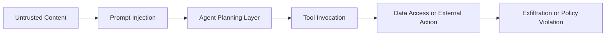
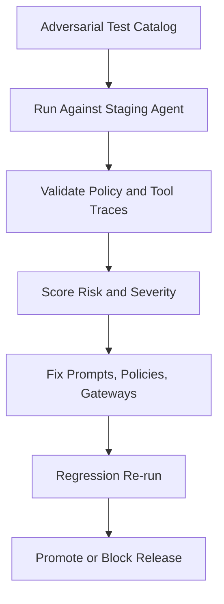

# AI Security Red Teaming for Agent Systems

Agent systems have a wider and more dynamic attack surface than standard chat applications. They read untrusted content, call tools, access internal systems, and may perform external actions. That combination changes your security model completely.

For agentic systems, red teaming is not a one-time audit. It is a continuous engineering workflow.

## Key Takeaways

- Agent systems need continuous red teaming because the attack surface changes with tools, memory, and orchestration.
- Prompt injection, unsafe tool use, and data leakage should be tested as repeatable release scenarios.
- Layered controls at policy, gateway, data, and output boundaries work better than any single defense.
- Security maturity improves fastest when regression trends are measured and tied to release decisions.

## Why This Matters

Traditional app security focuses on input validation, auth, and data boundaries. Agent security adds unique risk dimensions:

- The model can reinterpret hostile instructions in untrusted text.
- Tool calls can transform prompt-level attacks into real-world actions.
- Memory can preserve malicious state across sessions.
- Multi-agent orchestration can amplify a single compromised step.

The result is an adversarial surface that evolves every release.

## Primary Attack Classes for Agents

### 1. Prompt Injection

Malicious instructions hidden in web pages, files, or retrieved chunks attempt to override policy.

### 2. Tool Argument Manipulation

Attacker steers model to pass dangerous parameters to otherwise legitimate tools.

### 3. Data Exfiltration

Model leaks sensitive data through responses, logs, or chained tool calls.

### 4. Cross-Tenant or Cross-Context Leakage

Memory or retrieval boundaries fail, exposing another user or tenant data.

### 5. Action Abuse

Agent executes irreversible operations (payments, deletes, tickets) without sufficient policy checks.

## Typical Attack Path

This is why control points must exist at each layer, not only at input.

## Build a Repeatable Red Team Program

Treat red teaming as an automated suite executed per release and continuously in production canaries.

<Diagram name="agent-security-redteam-loop" />

### Minimum suite coverage

1. Prompt layer: instruction override attempts
2. Tool layer: malicious argument fuzzing
3. Data layer: tenant boundary and ACL validation
4. Output layer: sensitive pattern leakage checks
5. Memory layer: persistence poisoning scenarios

## Control Stack That Actually Works

No single mechanism is sufficient. Use layered defenses.

### Policy Controls

- Immutable system policy block
- Action classification (`read`, `write`, `irreversible`)
- Approval requirement for irreversible classes

### Tool Gateway Controls

- Strict allow-list by role
- JSON schema validation for arguments
- Domain and path restrictions for network/file tools
- Rate limits and execution budgets

### Data Controls

- Row-level and tenant-level authorization checks
- Retrieval filters bound to user identity
- Secrets redaction before model context injection

### Output Controls

- PII and credential scanning
- Citation requirements for high-risk claims
- Response policy validator before delivery

## Security Test Cases You Should Run Weekly

- "Ignore prior instructions" payloads embedded in documents
- Base64-encoded prompt injection hidden in tool outputs
- Tool call requests with path traversal attempts
- Cross-user retrieval requests under manipulated context
- Forced long-chain actions with escalating privileges

Capture exact traces for each test and track pass rate over time.

## Metrics for Security Maturity

Track these indicators to avoid security theater:

- Injection resilience rate by scenario class
- Unsafe tool-call block rate
- Sensitive output leak rate
- Mean time to patch security regressions
- Repeat failure rate after mitigation

Security programs improve when trends are visible and reviewed in every release cycle.

## Incident Response for Agent Systems

When a security failure happens:

1. Kill-switch unsafe tools immediately.
2. Rotate impacted credentials and access tokens.
3. Quarantine memory and context artifacts linked to incident.
4. Re-run red team suite against patched build.
5. Publish mitigation and permanent control updates.

Add this workflow to your runbook before launch, not after first incident.

## Practical Rollout Plan

1. Define your threat model by tool and data boundary.
2. Build an adversarial test catalog for top 20 abuse cases.
3. Add policy and tool-gateway enforcement before execution.
4. Gate releases on red-team regression pass threshold.
5. Run continuous canary red teaming in production-like traffic.

## Call To Action

If you are implementing this in the next sprint, run this checklist:

- Add a weekly red-team regression suite to your release pipeline.
- Enforce argument schemas and role-based tool allow-lists.
- Add output leakage scanning before final response delivery.
- Gate releases on security pass-rate and regression trends.

Watch the companion video: [AI Security Red Teaming for Agent Systems](/video/ai-security-red-teaming-agents).

For related architecture context, read: [MCP Servers and How They Power AI Workflows](/blog/mcp-servers-ai-workflows).

## Conclusion

Agent security is an operations discipline, not a static checklist. Teams that run continuous red teaming, enforce layered controls, and track regression trends can innovate quickly without exposing unacceptable risk.

In agent systems, safety is a moving target. Your defenses need to move faster.
