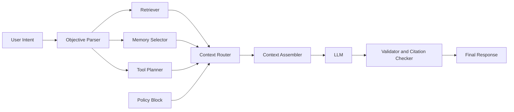
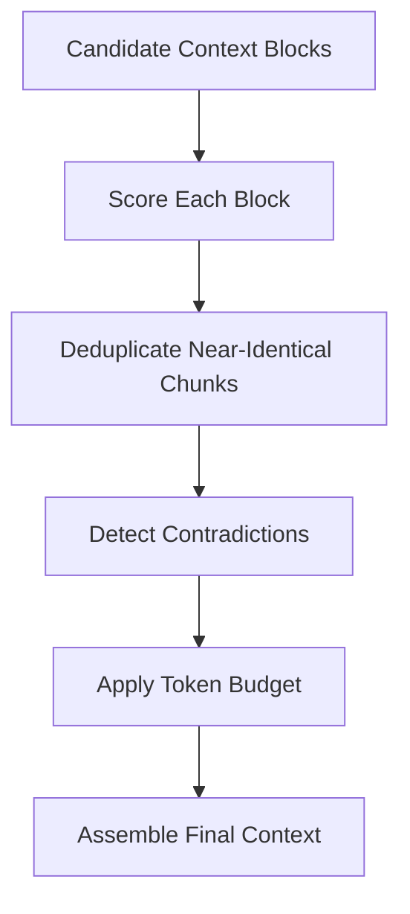

# Model Context Engineering Beyond RAG

RAG gave LLMs access to external knowledge. That solved a major limitation, but it did not solve quality at scale. In real systems, many failures now happen even when relevant documents are available.

Why? Because context assembly is often noisy, contradictory, and unbounded.

Context engineering is the discipline of deciding exactly what enters the model input, in what order, under which budget and policy constraints.

## Key Takeaways

- Strong AI output depends on context composition, not just retrieval quality.
- Policy, memory, evidence, and tool outputs should be treated as separate context blocks with explicit budgets.
- A context router should score, deduplicate, and prune before anything reaches the model.
- Context-level metrics help improve quality without changing the underlying model.

## Why This Matters

A production response is usually composed from multiple sources:

- System instructions and policy constraints
- User objective and output format
- Session memory and user preferences
- Retrieved evidence from search indexes
- Tool outputs (APIs, databases, calculators)

If these blocks are merged naively, model quality degrades even with better models.

## From Retrieval Pipeline to Context Pipeline

Most teams focus on improving retrieval relevance. Fewer teams optimize context composition.

<Diagram name="context-assembly-router" />

The context router is the critical layer. It decides what survives the token budget.

## A Practical Layered Context Architecture

Use a deterministic layering strategy:

1. Immutable policy block
2. Objective block with explicit success criteria
3. Retrieval evidence block with per-chunk citation metadata
4. Minimal working memory block
5. Tool result block
6. Output schema and format constraints

Each block should be independently testable and truncatable.

## Budgeting: The Hidden Quality Lever

Context windows are finite. Without explicit budgets, low-value history pushes out high-value evidence.

Example budget policy:

- Policy and objective: 10 percent
- Evidence: 45 percent
- Tool output: 25 percent
- Memory: 10 percent
- Reserved margin for generation and schema repair: 10 percent

Budgeting keeps critical blocks from starvation.

## Scoring and Pruning Strategy

A robust router should score candidates on multiple dimensions:

- Relevance to current objective
- Freshness and staleness risk
- Source trust level
- Novelty versus already-selected chunks
- Citation completeness

Then apply deduplication and contradiction checks before assembly.

## Common Failure Modes and Fixes

### 1. Stale Memory Overrides New Intent

Symptom: agent repeats old assumptions after user changes direction.

Fix:

- Timestamp memory entries
- Apply decay function by recency
- Require objective-alignment score above threshold

### 2. Evidence Flooding

Symptom: too many similar retrieval chunks consume context budget.

Fix:

- Semantic deduplication
- Max chunk count per source
- Diversity constraints by subtopic

### 3. Citation Drift

Symptom: model outputs claims with weak or missing references.

Fix:

- Keep citation IDs in every evidence chunk
- Enforce output schema requiring citation field
- Post-generation citation verifier

### 4. Tool Result Dominance

Symptom: large tool output overwhelms policy and evidence.

Fix:

- Summarize tool output into bounded schema
- Store raw output externally with reference handle
- Inject only relevant slices

## Context Quality Evaluation Framework

Beyond model benchmarks, evaluate context quality directly:

- Context precision: percentage of injected tokens actually used
- Citation faithfulness: claims linked to valid evidence
- Contradiction rate: conflicting blocks in same prompt
- Truncation loss: important blocks removed by budget
- Outcome reliability: pass rate on fixed scenario sets

This gives actionable feedback even when base model remains unchanged.

## Implementation Blueprint

1. Define context block schema and metadata fields.
2. Build a router with scoring, dedupe, and budget enforcement.
3. Add an assembly step that preserves block ordering.
4. Enforce output schema with citation requirements.
5. Add offline tests for contradictory and noisy contexts.
6. Track context metrics in production telemetry.

## Call To Action

If you are implementing this in the next sprint, run this checklist:

- Add a context router with explicit scoring and pruning rules.
- Set token budgets per context block category.
- Enforce citation-aware output schema validation.
- Track context quality metrics in production dashboards.

Watch the companion explainer: [Model Context Engineering Beyond RAG](/video/model-context-engineering-beyond-rag).

For foundational retrieval context, also read: [RAG: Retrieval-Augmented Generation](/blog/rag-retrieval-augmented-generation).

## Conclusion

After RAG, the biggest quality gains come from context composition, not larger prompts. Teams that treat context as a designed system layer ship more reliable AI features with lower token waste and clearer explainability.

Better context engineering is usually the fastest way to improve output quality without changing models.
