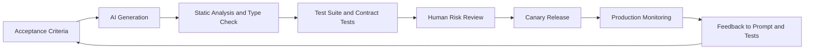
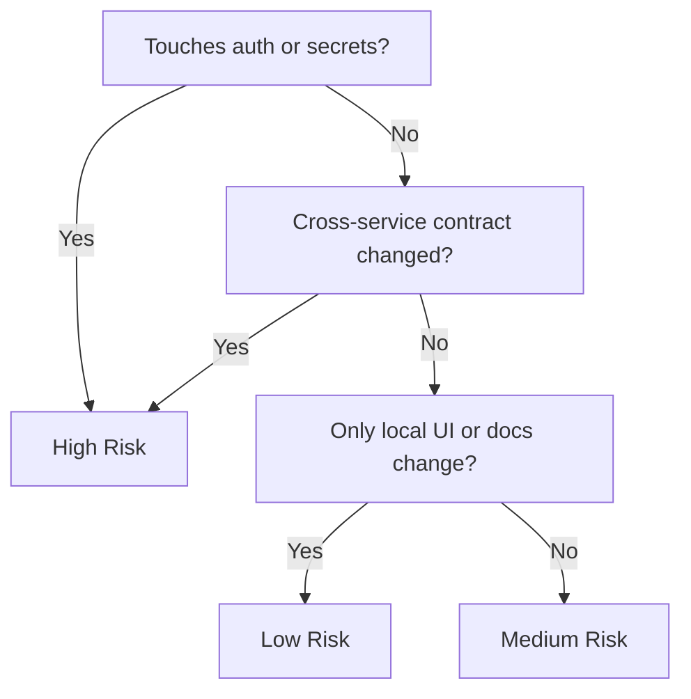

# From Vibe Coding to Reliable Software

AI coding assistants can make teams dramatically faster, but speed without reliability is expensive. The teams that win with AI do not avoid generation; they operationalize it.

Generated code should be treated like an eager junior engineer: useful, productive, and always in need of verification against explicit acceptance criteria.

## Key Takeaways

- AI coding speed only creates value when it is paired with deterministic quality gates.
- Acceptance criteria, tests, and rollout safeguards matter more than prompt cleverness.
- Risk-based review helps teams focus human attention where AI-generated code can do the most damage.
- Reliability metrics like revert rate and defect escape rate are essential for judging real progress.

## Why This Matters

When generation speed increases, delivery systems experience new failure modes:

- Hidden assumptions between services
- Copy-pasted but incomplete error handling
- Security gaps in utility wrappers
- Brittle tests that validate happy paths only

None of these are solved by banning AI. They are solved by improving the delivery loop.

## The Reliable AI Delivery Loop

Use a fixed pipeline where quality checks are first-class gates, not optional steps.

<Diagram name="vibe-reliability-loop" />



This loop creates compounding reliability. Every regression improves future prompts, test fixtures, and review checklists.

## Step 1: Write Better Inputs Before Generation

Prompt quality matters less than requirement quality. Before asking AI to implement, define:

- Functional requirement
- Non-functional constraints (latency, memory, cost)
- Security and compliance rules
- Explicit acceptance tests

If requirements are vague, generated code will look complete while being wrong.

### A practical prompt frame

```text
Task: Implement endpoint X with pagination and role-based auth.
Constraints: p95 under 200ms, no N+1 queries, OWASP input validation.
Output: TypeScript only, include tests for empty, large, and unauthorized cases.
Do not: introduce new dependencies without justification.
```

## Step 2: Automate Mechanical Validation

AI-generated changes should immediately pass deterministic checks:

- Lint and formatting
- Type checking
- Dependency policy checks
- Secret and credential scanning

Fast failures here save review time for architectural and product decisions.

## Step 3: Expand Test Strategy for AI Era

Classic unit tests are necessary but insufficient. Add:

- Contract tests between modules/services
- Regression tests generated from past incidents
- Property-based tests for parser and transformation logic
- Snapshot or schema tests for structured outputs

In AI-heavy codebases, contract tests catch integration breakage earlier than end-to-end tests.

## Step 4: Risk-Based Human Review

Not all files require the same review depth. Prioritize human attention on high-blast-radius areas:

- Authentication and authorization
- Billing and financial calculations
- Data migration logic
- Infrastructure and deployment changes

Low-risk refactors can be reviewed quickly. High-risk changes require deeper design validation.

## A Practical Risk Scoring Model



Map this score to review policy:

- Low: one reviewer + full CI
- Medium: one domain reviewer + canary required
- High: senior reviewer + staged rollout + rollback plan

## Step 5: Release Safety Nets

Even good reviews miss issues. Ship with runtime safeguards:

- Feature flags
- Canary rollout by percentage
- Automatic rollback on SLO breach
- Shadow traffic for risky paths

Treat release strategy as part of code quality, not a separate ops concern.

## Metrics That Reveal Real Quality

Track AI-specific engineering health metrics:

- Revert rate for AI-assisted pull requests
- Defect escape rate by risk tier
- Mean time to detect and recover
- Percentage of PRs with generated test updates
- Prompt-to-merge cycle time

Pair speed with reliability metrics. A faster team with rising revert rate is not actually faster.

## Team Operating Model That Works

Strong teams usually adopt these conventions:

- Prompt and acceptance criteria stored in PR description
- Required test evidence attached before review
- Postmortems feed a shared "anti-pattern prompt" library
- AI usage is transparent, not hidden

This converts individual AI productivity into organizational reliability.

## Common Anti-Patterns

- Shipping code the author cannot explain
- Accepting generated code without boundary tests
- Reviewing only style, not behavior
- Measuring output volume instead of production outcomes

The goal is not to prove AI value with LOC counts. The goal is durable delivery.

## Call To Action

If you are implementing this in the next sprint, run this checklist:

- Add one risk rubric for AI-generated pull requests.
- Make contract tests mandatory for service interfaces.
- Require canary rollout for medium and high-risk changes.
- Track revert rate and defect escape rate by change source.

Want the condensed version first? Watch: [From Vibe Coding to Reliable Software](/video/vibe-coding-reliable-software).

For related engineering workflows, read: [AI Coding Assistants Compared](/blog/ai-coding-assistants-compared).

## Conclusion

Vibe coding is not the problem. Uncontrolled delivery is the problem. Teams that combine AI acceleration with deterministic quality gates can ship faster without paying the reliability tax later.

Speed is a feature only when correctness survives production.
