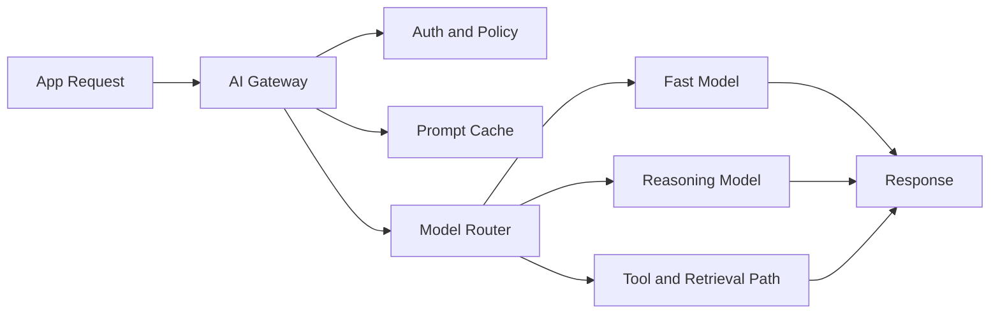
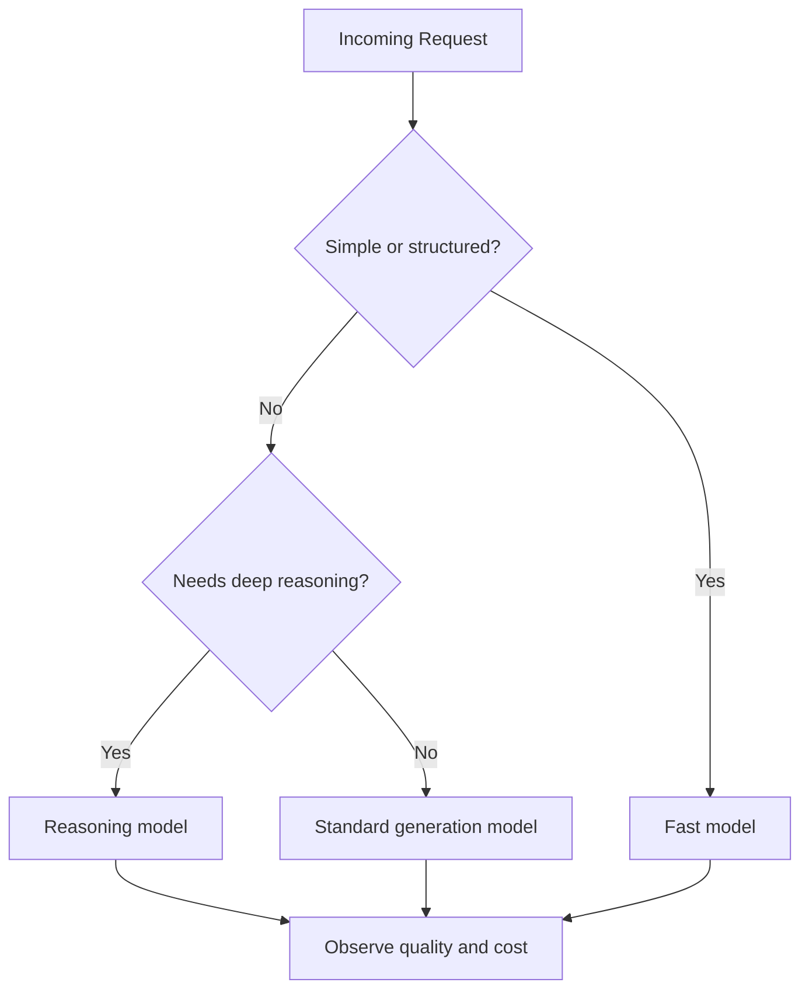

# AI Gateway Patterns for LLM Apps

Most teams building with LLMs start simple: app sends prompt, model returns text. That works for prototypes, but it breaks down quickly in production. Costs drift, latency spikes, policies become inconsistent, and every team reinvents the same routing logic.

This is where an AI gateway becomes useful. It gives LLM apps a single control plane for authentication, model routing, caching, observability, and fallback behavior.

## Key Takeaways

- An AI gateway turns scattered prompt calls into a governed production pathway.
- The highest-value gateway features are authentication, routing, caching, budgets, and observability.
- Prompt caching and model routing are often the fastest ways to reduce cost without hurting quality.
- A gateway should be opinionated about policy and failure handling, not just request forwarding.

## Why This Matters

Without a gateway, most LLM applications accumulate hidden complexity:

- Different teams choose different models with no shared policy.
- Cost controls live in application code instead of one consistent place.
- Retries and fallbacks are implemented differently across services.
- Traces and usage analytics are incomplete or fragmented.

The result is the same pattern seen in other infrastructure layers: once usage grows, you need an operating layer between clients and compute.

## What an AI Gateway Actually Does

At a high level, an AI gateway sits between applications and downstream model providers or tool systems.

<Diagram name="ai-gateway-llm-apps" />

This pattern gives you one place to answer practical questions:

- Which model is allowed for this tenant?
- Should this request hit cache first?
- What is the maximum token budget?
- When do we downgrade, retry, or fail closed?

## Core Gateway Capabilities

### 1. Authentication and Policy Enforcement

The gateway should validate who is calling, what they are allowed to do, and which model or tool classes are permitted.

Typical controls include:

- Tenant-aware API keys or JWT validation
- Model allow-lists by customer or environment
- Tool permission boundaries
- Token and request quotas

This keeps policy out of dozens of application code paths.

### 2. Model Routing

Not every prompt deserves the most expensive model.

A practical router can choose between:

- Small model for extraction, tagging, or rewriting
- Mid-tier model for chat and standard generation
- Reasoning model for planning, debugging, or hard decision work

Routing rules can be based on:

- Request type
- Prompt length
- Latency budget
- User tier
- Confidence or fallback state

## A Practical Routing Strategy

The best gateway routers are explicit, observable, and cheap to override.

### 3. Prompt Caching and Semantic Caching

Caching is one of the most practical gateway features because it improves both latency and spend.

Two useful patterns:

- Exact prompt caching: same input, same answer, short TTL
- Semantic caching: similar prompt and context, reusable answer under tight confidence rules

Good candidates for caching include:

- Stable system prompt + FAQ combinations
- Repeated extraction jobs
- Template-driven support flows

Bad candidates include:

- Personalized outputs with sensitive context
- Rapidly changing operational data
- High-stakes reasoning tasks that need fresh context

### 4. Budget and Rate Controls

An AI gateway should enforce cost discipline automatically.

Useful controls:

- Max input tokens per request
- Max output tokens by route
- Per-tenant monthly budget caps
- Request rate limits by model tier
- Hard stop for runaway retry loops

This is the difference between “we watch spend later” and “we control spend by design.”

### 5. Observability and Evaluation Hooks

If the gateway is the central path, it should emit the central telemetry.

Track at least:

- Request latency by route and model
- Token usage and estimated cost
- Cache hit rate
- Policy denials
- Fallback rate
- Error rate by provider or tool path

The gateway is also a natural place to attach evaluation hooks for offline review and release analysis.

## Failure Modes You Should Expect

### Cache Poisoning or Stale Cache

If cache invalidation is too loose, users get outdated or incorrect answers.

Mitigation:

- TTL by route type
- Context-aware cache keys
- Route-level cache disable switch

### Bad Routing Defaults

If the router overuses premium models, cost grows too fast. If it overuses cheap models, quality drops.

Mitigation:

- Route by explicit rule first
- Measure quality and cost per route
- Review drift every release cycle

### Fallback Loops

If provider fallback is too aggressive, one bad upstream event creates retry storms.

Mitigation:

- Bounded retries
- Circuit breakers
- Fail closed for high-risk tool paths

### Missing Policy Consistency

If some traffic bypasses the gateway, observability and governance become incomplete.

Mitigation:

- Make gateway the default SDK path
- Alert on direct provider access outside approved routes

## Build Sequence That Works

If you are introducing a gateway now, do it in this order:

1. Centralize auth, quotas, and request tracing.
2. Add model routing with explicit route classes.
3. Introduce exact-match caching for stable flows.
4. Add semantic cache only where freshness risk is low.
5. Add evaluation and release review hooks.
6. Add provider fallback and cost optimization last.

This sequence prevents you from building a smart router before you even have the data to tune it.

## When You May Not Need One Yet

You probably do not need a full gateway if:

- You have one internal app and one model route
- There is no multi-tenant policy complexity
- Spend and latency are still trivial
- No tool-use or retrieval path is involved

In that phase, a thin wrapper is enough. The gateway becomes valuable when governance and optimization matter more than raw experimentation speed.

## Call To Action

If you are implementing this in the next sprint, run this checklist:

- Define 3 route classes: cheap, standard, and reasoning.
- Put auth, budgets, and tracing in one shared gateway layer.
- Add exact prompt caching for one high-volume stable workflow.
- Track latency, cost, fallback rate, and cache hit rate per route.

For related reading, see [Model Context Engineering Beyond RAG](/blog/model-context-engineering-beyond-rag) and [AI Security Red Teaming for Agent Systems](/blog/ai-security-red-teaming-agents).

## Conclusion

AI gateways are not just traffic routers. They are the operational layer that makes LLM apps governable at scale. Once prompts become production traffic, you need one place to control budgets, routing, caching, and policy.

The teams that add this layer early usually spend less, debug faster, and avoid rebuilding the same guardrails in every app.