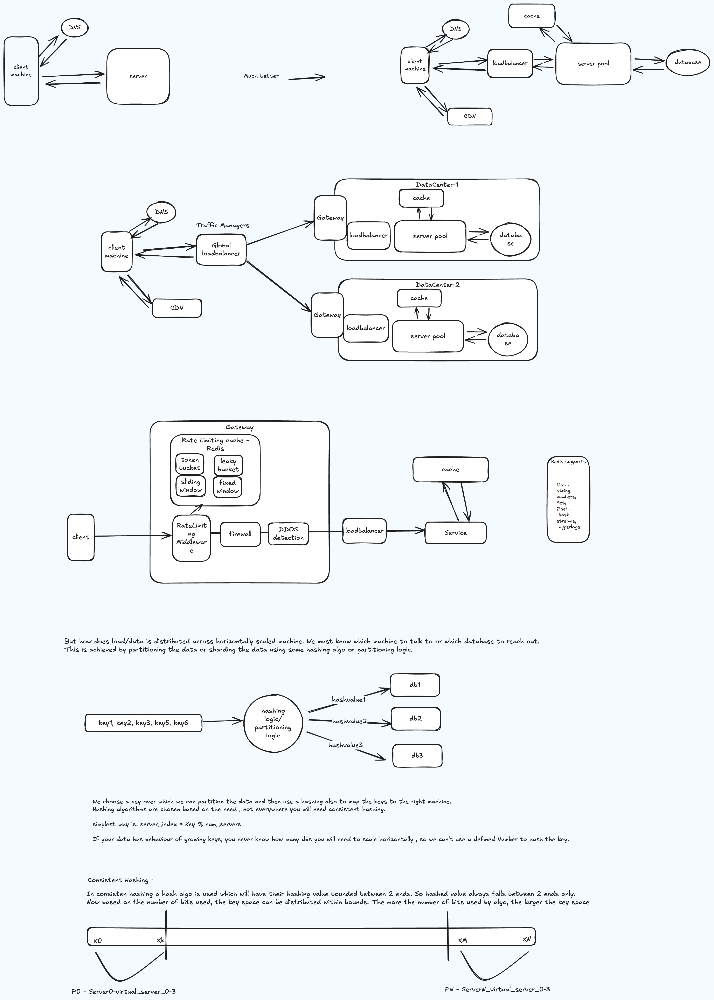

Understanding the basic request flow is fundamental to every distributed system design. The diagram below illustrates the common path a request takes from client to server and back, touching load balancing, service processing, data storage, and caching layers.

### Request Flow Diagram

### What to Observe

1. **Client → Load Balancer** — The request enters through a load balancer that distributes traffic across service instances.
2. **Load Balancer → Service** — The selected service instance picks up the request for processing.
3. **Service → Cache** — Before hitting the database, the service checks the cache for frequently accessed data.
4. **Service → Database** — On a cache miss, the service queries the database and optionally populates the cache for future requests.
5. **Response Path** — The response travels back through the same layers to the client.

### Key Takeaways

- Every additional network hop adds latency — minimize them where possible
- Caching dramatically reduces database load for read-heavy workloads
- Load balancers enable horizontal scaling by adding more service instances
- This basic pattern applies to the majority of system design interview questions