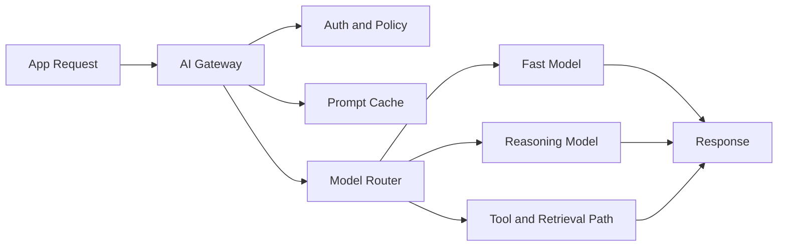
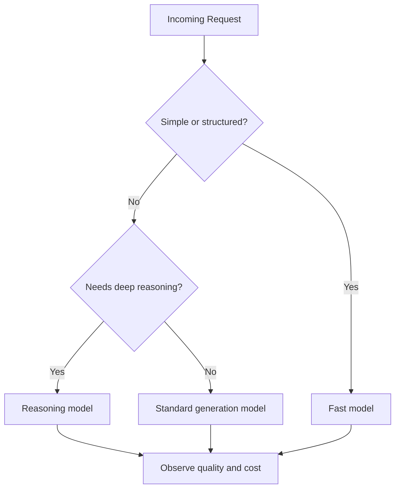

# AI Gateway Patterns for LLM Apps

## Why Teams Need a Gateway

- Centralize auth, policy, and tenant controls
- Route traffic by quality, latency, and cost needs
- Add caching and fallback without duplicating logic in every app

## Gateway Request Path

The gateway sits between the app and every downstream model or tool path.

## Core Gateway Functions

Authentication and Policy | Verify caller identity, quotas, and allowed model routes
Prompt Cache | Serve stable repeated prompts with lower latency and cost
Model Router | Send simple work to fast models and hard work to reasoning models
Observability | Track latency, tokens, cache hits, failures, and cost

## Routing Strategy

- Fast model for classification, extraction, and rewriting
- Standard model for normal generation and chat
- Reasoning model for hard planning and deep analysis
- Tool or retrieval path when external context or action is needed

## Routing Decision Flow

Use simple routing rules first, then refine them with observed quality and cost data.

## Caching and Budget Controls

- Use exact-match caching for stable workflows
- Add semantic caching only where freshness risk is low
- Enforce token caps, rate limits, and per-tenant budgets
- Stop retry loops before they become cost incidents

## Common Failure Modes

- Router sends too much traffic to expensive models
- Cache returns stale answers after context changes
- Fallback loops amplify upstream provider issues
- Apps bypass the gateway and lose policy consistency

## Key Takeaway

An AI gateway is the operating layer that makes LLM apps governable at scale.