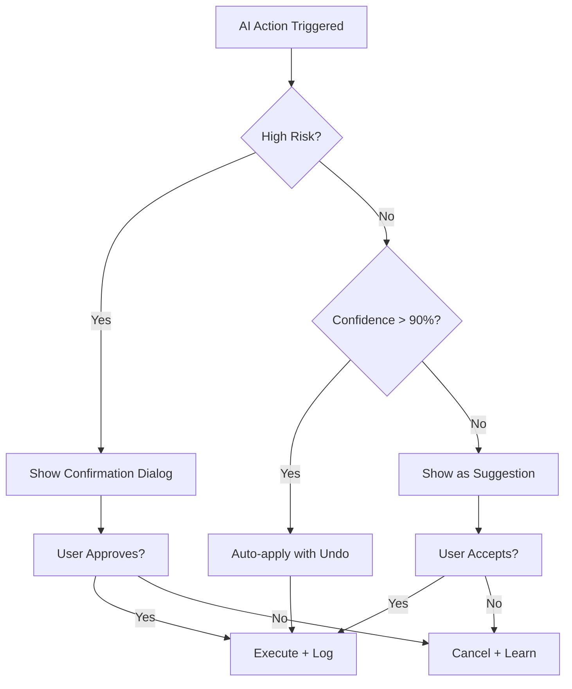

# AI UX Patterns Users Actually Trust

## What Users Need

- Clear scope of what AI can and cannot do
- Confidence indicators with uncertainty language
- Easy correction and undo pathways

## Trust Patterns

- Show evidence and citations inline
- Separate suggestions from final actions
- Ask confirmation for risky operations
- Keep action history visible and reversible

## Trust Decision Flow

## Anti-Patterns

- Overconfident wording with no citations
- Hidden automation without user consent
- No fallback when AI is uncertain

## Trust KPI Dashboard

Metric | Why It Matters
Undo rate after AI actions | Detect overreach
User correction rate | Measure output mismatch
Task completion with AI assist | Validate real value
Support tickets linked to AI | Surface trust issues

## Key Takeaway

Trust is a product design outcome, not a model parameter.
