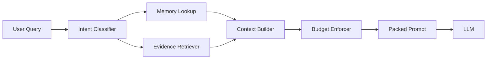

# Model Context Engineering Beyond RAG

## The New Bottleneck

Most systems fail from poor context shape, not poor model quality.

## Context Assembly Pipeline

## Layers of Context

- User intent and constraints
- Session memory and prior decisions
- Retrieved evidence ranked by relevance
- Tool state and execution traces

## Context Packing Strategy

Layer | Rule
System policy | Always include
Task summary | Include concise objective and done criteria
Evidence snippets | Include only citation-backed facts
Scratchpad | Include minimal intermediate state

## Practical Tactics

- Use schema-driven context blocks
- Penalize stale or duplicate retrieval chunks
- Add context budget caps by section
- Force citation links in final answer

## Key Takeaway

Context engineering is now a first-class product capability, not a prompt tweak.
