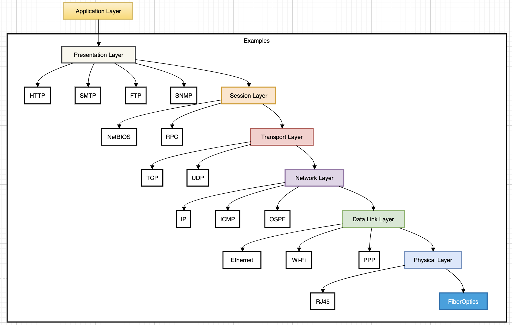

There are various network protocols and they works at different layers of OSI model. The digaram below gives a quick reference of protocols and layers at which they work. There are more than these protocols but we hae just mentioned the common ones. 

Advice is to have an understanding of these protocols. 

### Networking Devices 

Hub | Multiport repeater, Half Duplex, No intelligence, connect Devices together
-- | --
Switch | Forward traffic to right destination
Router | Route Tables, forwarding based on IP Table , connected multiple type of networks
Access Point | Wireless router or WAP , Bridge to connect, wired or wireless
DSL |  
Repeater | Regenrates signals
FireWall | Filters traffic , routers or dedicated hardware
Bridge |  
Patch Panels |  
CloudBased network controller | Central way to
EOP ethernet over power lines |  
Power over ethernet |  
		

### Most Used common protocols 

Scenario | Protocol |   | Ports | Details
|-- | -- | -- | -- | --|
|Files | FTP |   | 20/21 | 
  | AFP |   | 548 |  
  | SMB | TCP | 445 |  
  |   |   |   |  
Emails | SMTP | 25 | 25 |  
  | POP3 |   | 110 |  
  | IMAP |   | 143 |  
  |   |   |   |  
Web | HTTPS |   | 443 |  
  | HTTP |   | 80 |  
  |   |   |   |  
Management | Telnet |   | 23 |  
  | SSH |   | 22 |  
  | SNMP | TCP/UDP | 161/162 |  
  | RDP |   | 3389 |  
  |   |   |   |  
DNS |   |   | 53 |  
DHCP |   |   | 67/68 |  
SLP(Service Location Protocol) |   |   | 427 |  
NetBios |   | TCP/UDP | 137/138/139 |  
LDAP( Lightweight Directory Access Protocol) |   | TCP/UDP | 389 |  
Network time Protocol |   |   |   |  
ARP( Address Resolution Protocol) |   |   |   |  
