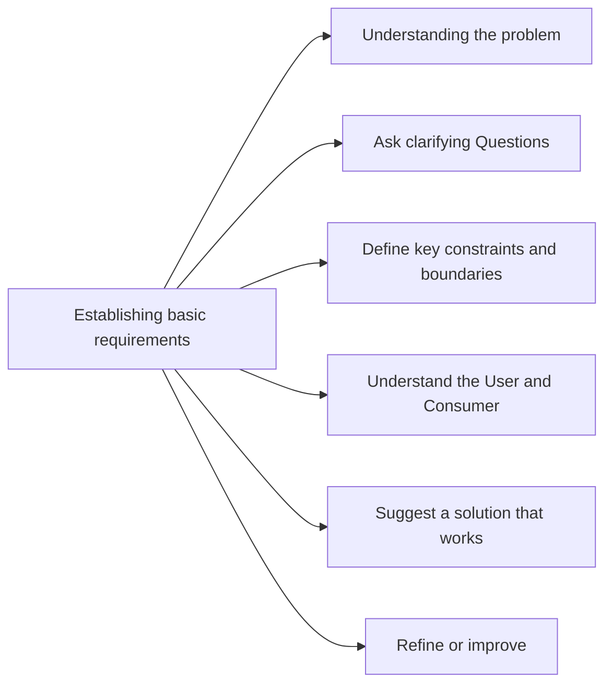
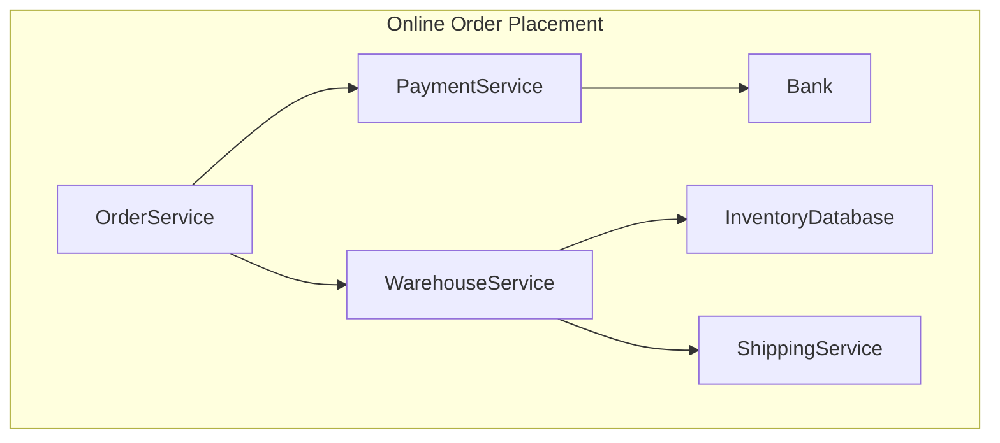

At every moment of interview you will have mto make a choice, in-orde to make a choice , we suggest to adopt a few techniques which will help you to organize your itenrviews into logical sections as well. 

define how basic requirements for an system design interview  should be established between and interviewer and interviewee. 

### Decision matrix

A decision matrix is a visual comparison of how various alternatives stack up against one another. Use a decision matrix to qualify design alternatives so a decision can be made. A decision matrix can also be used in documentation as a part of the design’s rationale.

- Use to compare a variety of decisions such as patterns, technologies, or frameworks.
- Visualize relative strengths and weaknesses among decisions.
- Focus attention on essential factors when comparing and contrasting alternatives.
- Facilitate open discussion about trade-offs among alternatives.

### Sequence Diagrams 

example a simple sequence diagram for showing flow of Online - Order Placement Service

_**BENEFITS**_ \
Simple and flexible notation \
Useful for communication and reasoning \
Helps to identify missing informations

### Scenario Walkthrough

Describe step-by-step how the architecture addresses a specific quality attribute scenario. Scenario walkthroughs can be used any time but are most applicable early in the life of the software system, before the system’s behavior can be observed directly.

A scenario walkthrough is like telling a story about the architecture. Pick a quality attribute scenario and describe what the system would do in response to the scenario stimulus. As you walk through the various elements in your design, show how the quality attribute is promoted (or not) by the system.

_**BENEFITS**_ \
Assess the architecture design early, even while it’s only on paper. \
Identify different concerns in the architecture. \
Reason about how the architecture will respond to different stimuli. \
Qualify the design. Walkthroughs are not strict pass or fail. \
Quickly determine the extent to which the architecture promotes or inhibits different quality attributes. 

